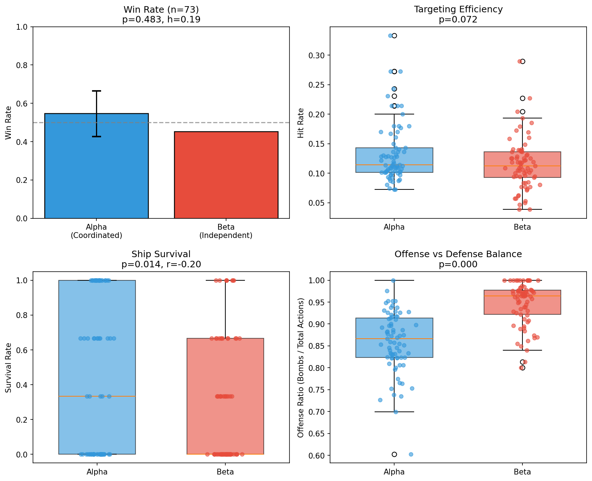

# LLM Agent Network: Does Coordination Make Multi-Agent Teams Smarter?

## The Problem

Multi-agent LLM systems are increasingly deployed for complex tasks, but a fundamental question remains unanswered: **does structured coordination actually help, or do independent agents perform just as well?**

This matters because coordination has costs. Deliberation takes time and tokens. Voting requires consensus-building. Shared memory increases context length. If individual agents can match coordinated teams, the simpler architecture wins.

**What's missing:** Clean experimental comparisons are rare. Most multi-agent benchmarks conflate coordination benefits with other variables (different prompts, asymmetric information, turn-order advantages). We need a controlled environment where coordination is the *only* variable.

## Research Questions

1. **RQ1:** Does inter-agent coordination improve team performance in adversarial settings?
2. **RQ2:** What mechanisms explain coordination benefits (or lack thereof)?
3. **RQ3:** How does coordination affect offensive vs. defensive strategy allocation?

## Our Approach

We built a **Dynamic Battleship** testbed that isolates coordination effects:

- **Two teams, identical capabilities:** Alpha Squadron (coordinated) vs. Beta Fleet (independent)
- **Same information:** Both teams see the same battlefield state
- **Simultaneous execution:** No turn-order bias
- **Only difference:** Alpha deliberates (propose → critique → execute); Beta decides independently

### Alpha's 3-Phase Deliberation Protocol
1. **Proposal:** Each agent proposes a complete team strategy with reasoning
2. **Critique:** Agents evaluate and vote on proposals
3. **Execution:** Team executes the selected coordinated plan

### Beta's Independent Approach
- Each agent chooses actions independently
- No communication, no shared planning
- Parallel decision-making

## Preliminary Results (n = 22)

> **Note:** This is an ongoing experiment. Results below are preliminary and require additional trials for statistical confirmation. We are actively running more simulations and refining the experimental protocol.

### Summary Table

| Metric | Alpha (Coordinated) | Beta (Independent) | p-value |
|--------|---------------------|-------------------|---------|
| Win Rate | **68.2%** (15/22) | 31.8% (7/22) | 0.134 |
| Ship Survival | **56.1%** | 24.2% | 0.008** |
| Repeated Targets/Game | **2.86** | 13.41 | <0.001*** |
| Offense Ratio | 88.1% | 96.2% | <0.001*** |
| First Elimination | 5 games | 17 games | - |

Effect size (Cohen's h): 0.74 (large)



### Key Findings

**RQ1: Does coordination improve performance?**

The coordinated team (Alpha) wins 68% of games compared to 32% for independent agents. While not yet statistically significant (p = 0.134) due to limited sample size, the effect size is large (h = 0.74). Critically, survival rate shows a significant difference: coordinated teams preserve 56% of ships vs. 24% for independent teams (p = 0.008).

**RQ2: What mechanisms drive the difference?**

The clearest finding is **targeting efficiency**. Independent agents waste nearly 5x more bombs on previously-targeted coordinates (13.4 vs 2.9 repeated targets per game, p < 0.001). This suggests coordination's primary benefit is *collective memory* and *action deconfliction*, not improved individual decision quality.

Supporting this interpretation: hit rates are nearly identical (13.5% vs 11.9%, p = 0.76). When agents do shoot at new targets, they perform equally well. Coordination doesn't make agents smarter; it prevents them from duplicating effort.

**RQ3: How does coordination affect strategy?**

Coordinated teams allocate more resources to defense. Alpha uses 202 moves across all games vs. Beta's 64 (offense ratio: 88% vs 96%, p < 0.001). This defensive flexibility likely explains the survival gap. Beta's near-exclusive focus on offense (96%) means they rarely evade incoming attacks.

The first-elimination data reinforces this: Beta loses a player first in 17/22 games (77%). Coordination provides early-game protection.

### Interpretation

Coordination benefits emerge not from better individual reasoning but from **collective resource allocation**:

1. **Deconfliction:** Deliberation prevents multiple agents from targeting the same coordinate
2. **Strategic balance:** Shared planning enables offense/defense tradeoffs that independent agents miss
3. **Early protection:** Coordinated defense reduces first-blood disadvantage

## Limitations and Ongoing Work

This project is **actively in development**. Current limitations include:

- **Sample size:** n = 22 valid games is insufficient for definitive conclusions on win rate. We estimate needing n > 50 for adequate statistical power.
- **Error rate:** 29/51 games (57%) ended in errors or timeouts, indicating system stability issues being addressed.
- **Single model:** Results are from one LLM configuration. Generalization across models is untested.
- **Fixed protocol:** Only one coordination mechanism (propose-critique-vote) has been evaluated.

**Planned extensions:**
- Scale to 100+ valid trials
- Test alternative coordination protocols (e.g., hierarchical, emergent)
- Vary team sizes and ship configurations
- Cross-model experiments

---

## Quick Start

```bash
# Install dependencies
pip install ag2[ollama] networkx

# Start LLM server
CUDA_VISIBLE_DEVICES=0,1,2,3 OLLAMA_HOST=127.0.0.1:11436 ollama serve &

# Run single experiment
python battleship_runner.py --seed 123

# Run batch trials
for s in $(seq 1 50); do
  python battleship_runner.py --seed $((s*100))
done

# Analyze results
python analyze_results.py
```

## Project Structure

```
LLM-Agent-Network/
├── battleship_runner.py      # Main experiment launcher
├── battleship_game.py        # Game engine (simultaneous execution)
├── agent_network.py          # Agent communication layer
├── memory_manager.py         # Shared vs. individual memory systems
├── analyze_results.py        # Statistical analysis script
├── LLM_config.json           # Model configuration
├── battleship_config.json    # Game rules and team settings
├── output/                   # Game logs (JSON)
└── plots/                    # Generated figures
```

## Game Rules

- 10x10 grid, 3 ships per team (sizes: 4, 3, 2)
- Each agent controls one ship
- Dual action space: `BOMB <coord>` or `MOVE <direction>`
- Simultaneous execution each round
- Victory condition: Sink all enemy ships
- Player elimination: Agents are removed when their ship sinks

## Configuration

**LLM_config.json:** Model provider and parameters for each agent

**battleship_config.json:** 
- `team_coordination: true` enables deliberation (Alpha)
- `team_coordination: false` enables independent play (Beta)

---

## Citation

If you use this testbed, please cite:

```
@misc{llm-agent-network,
  title={LLM Agent Network: Coordination Effects in Multi-Agent Systems},
  year={2025},
  note={Work in progress}
}
```

---

*This is an active research project. Results are preliminary and subject to change as we collect more data.*